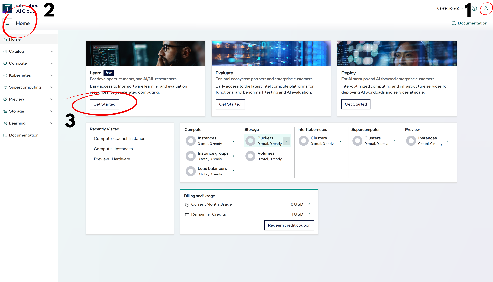
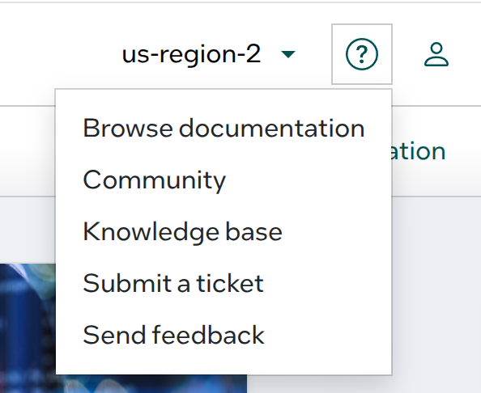
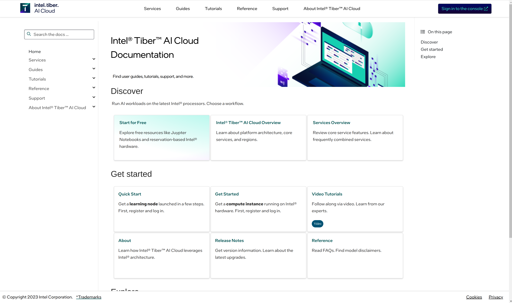

Intel Tiber Console Guide
=========================

This document gives an introduction of how to operate on the console, access the jupyter notebooks and gain an introduction on all the resources the console provides. Though some topics are not required for this lab, the document will give an overview of the developer cloud as a whole.

Introduction to the Console
---------------------------

|

|

Upon signing in, the console home screen is the first thing visible to users as seen from the above figure. The console itself has many features, but the three main highlighted ones in the image above are as follows:
|
1. My Profile
|
2. Home catalog
|
3. Jupyter Notebook Compute Instance
|
For this lab, only these three highlighted elements shown in Figure 1 are important, specifically number 3.

Console Documentation Help
--------------------------

To start with, the title bar consists of the Tiber logo, which upon being clicked will bring you from whichever page you are on the conole back to the console home. Towards thr ight hand side is an option to choose the region of operation, set to a default of *us-region-2*. To the left of the profile icon is a small help section that provides assistance and documentation in detail on wach part of the console and how to use them as shown in Figure 2. 

|

|

Help Options
############

Documentation
+++++++++++++

Both browsing documentation as well as the Documentation option given below the profile option explain how to quickly get started with setting up the rest of the profile and choosing which compute instance or jupyter notebook to work with. Utilize the *browse documentation* option for a more detailed and clearer explanation to set up the console. The documentation also has video tutorials to easily guide programmers on getting started.

|

|

Community
+++++++++

This option leads to the Developers community, where discussions based on different projects, issues and many more related to the console take place. This is one of the most useful places to get solutions on possible issues with the console in case anything does not work the way it should. Submitting commments and issues on this platform allows both other users as well as the console developers to answer the questions. 

Submit a Ticket
+++++++++++++++

In case of any issues with the console itself, this option can be used to report a problem with the console directly to the developers of the console, who can then contact you directly for immediate fixes. Ensure to submit the account number reference in this in order for them to trace your system, found in the profile section explained below.

My Profile
##########

This contains your account number reference that can be used to track your own personal console home. This number can be used to submit a ticket in case of any issues with the conosole, or can be used to gain credits in order to use more complex compute instances if required. This can be seen in the *Cloud Credits* option above the dark mode toggle. Any changes made to the profile can be done in the account settings next to the account number reference. 

Console Home Catalog
--------------------
