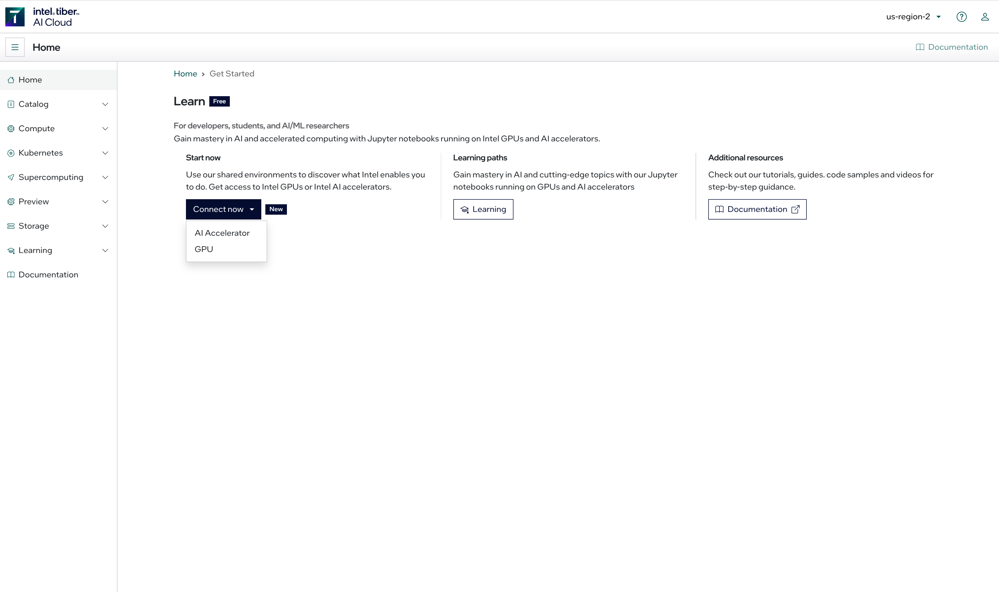

Accessing Jupyter Lab vis Tiber Console
=======================================

This document explains the steps required to access the jupyter lab and how to navigate around the console.

Access the Jupyter Lab
----------------------

From the `Console Guide <https://openvino-lab.readthedocs.io/en/latest/Console_guide.html>`_ documentation, we have seen that we can find the **Getting Started** option in the **Learn** section. This gives us different connection options shown in Figure 1. From here, we choose the GPU option and click on the **Connect** button to connect to the jupyter lab console. 

|

|