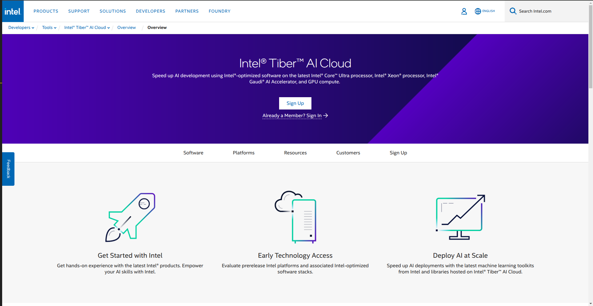

Setting up your Intel Account
=============================

This page will give the necessary steps for setting up the Intel Tiber Developer Cloud and getting the correct access permissions for operating on the Jupyter notebooks.

Sign up for a New Account
-------------------------

The First step is to go to the Intel Tiber official website:

`Intel Tiber HomePage <https://www.intel.com/content/www/us/en/developer/tools/tiber/ai-cloud.html>`_

This will lead to the Intel Tiber home page where it will ask for the Sign-in or Sign-up options as shown in the image below:

|

|

This website gives an introduction to the Developer Cloud platform and all the different tools and features it provides us with.
At the center of the screen, there is a sign-up button if you do not already have an account associated with Tiber. Click on this button to begin creating your account.
Enter the desired Email ID in the Sign up option shown on the screen (Preferably the ASU ID, any other ID can be used upon special request).
Once this is done, the following screen is shown below. Enter all the required details and click on the **Next: Verify your Email** option.

|

.. figure:: Images/Intel_SignUp.png
    :width: 100%
    :alt: Image Not Found
    :align: center

|

A verification confirmation should be sent via email ID with a link provided in the email. This verification email may take anywhere between a couple of seconds to 5 minutes to reach the account, so do stay a little patient with this!
Upon clicking the link provided in the verification email the initial login or Sign In page appears. Put in the details entered in the Sign-Up section to get the below screen:

|

.. figure:: Images/Intel_SignIn.png
    :width: 100%
    :alt: Image Not Found
    :align: center

|

A 6-digit verification number is usually sent to the phone number provided in the Sign-Up section. Check in the messaging app for a message from Intel Tiber, and enter the 6-digit number into the verification section.

This should take you to the Tiber Home Page as displayed below, confirming that you finally have your intel account!

|

.. figure:: Images/Intel_SignIn.png
    :width: 100%
    :alt: Image Not Found
    :align: center

|
